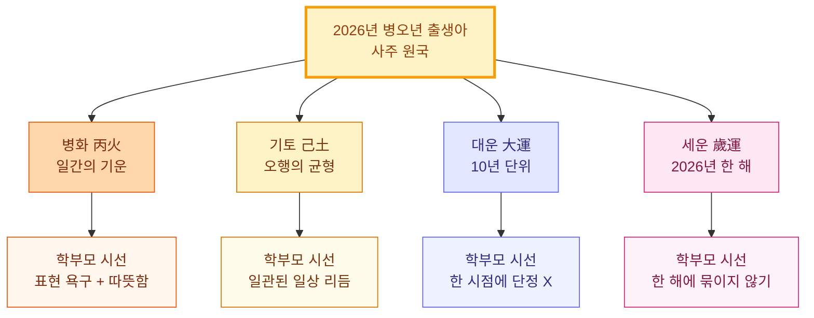
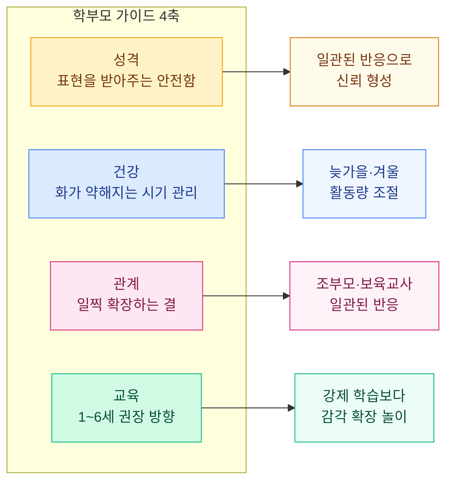

# 2026년 병오년 말띠 아기 운세, 명리 4기준으로 보는 성격·건강·관계

2026년에 출생한 아기를 안고 계신 보호자분들 중에는, "내 아이는 어떤 성향일까" 같은 생각을 하시는 분들이 많습니다. 2026년은 천간이 **병화(丙火)**, 지지가 **오화(午火)**로, 화(火) 기운이 사주 안에서 가장 강하게 도는 해입니다. 명리학에서는 이를 병오년(丙午年)이라 부릅니다.

연구소의 시선에서는, 신생아 시기의 운세는 "예언"이라기보다는 **부모가 아이의 기질을 가볍게 가늠해 보는 한 가지 시선**에 가깝습니다. 사주 명리의 네 가지 기준 — 병화·기토·대운·세운 — 으로 성격·건강·관계 흐름을 정리해 보았습니다. 모든 해석은 참고용이며, 진단·교육 결정의 근거로 사용되어서는 안 됩니다.

## 2026년(병오년)은 어떤 결인가

명리학에서 2026년은 **병(丙)·오(午)** 두 글자가 모두 화(火)에 속하는 해입니다. 화(火)는 따뜻함·밝음·확장·표현의 결을 가리키는 기운이며, 두 겹으로 겹치면 그 해에 태어난 아이의 사주 원국에 **화(火)의 기운이 기본 한 칸 더해진다**고 봅니다.

다만 모든 2026년 출생아가 동일한 사주를 가지는 것은 아닙니다. 사주는 연·월·일·시 네 기둥으로 완성되기 때문에 출생 월·일·시에 따라 일간(日干, "나 자신"을 가리키는 글자)이 달라집니다. "2026년 아이는 모두 화끈하다" 같은 단정은 적절하지 않으며, 연구소에서는 **화(火)의 기운이 평균보다 강해지는 해** 정도로 이해하는 편이 합당합니다.

### 화(火)의 기운이 강해질 때 자주 보이는 결

- 표현 욕구와 호기심이 일찍 드러남
- 활동량과 감정 반응이 또래보다 빠르고 또렷할 수 있음
- 따뜻하고 사교적인 면이 두드러지나, 동시에 예민한 반응도 함께 보임

이 결들은 명리학의 일반론이며, **아이를 어떻게 키울지를 결정하는 명분이 되어서는 안 됩니다.** 발달 속도와 성향은 개인차가 매우 크며, 같은 사주 안에서도 가정 환경·건강 상태·관계에 따라 다르게 발현됩니다.

## 병오년 출생 말띠, 기본 성향은 어떤 결인가

### 1. 기본 기질: 따뜻함과 표현력

병오년 출생아는 사주 원국에 화(火)가 두 겹 들어가는 해입니다. 화는 오행 중에서도 **밝음·따뜻함·외향성**의 결이 강해, 일찍부터 표정이 풍부하고 주변과 교감을 시도하는 아이가 많습니다. 부모가 보기에는 "표정 풍부하고 눈 마주치는 게 일찍부터 또렷하다"는 느낌으로 다가올 수 있습니다.

다만 화의 기운이 지나치게 강하면 **감정의 기복이 빠르게** 나타나기도 합니다. 같은 시기에 웃다가도 피곤하거나 자극이 많으면 갑자기 칭얼거리는 흐름이 자주 보일 수 있습니다. 이 역시 정상 발달의 한 양상입니다.

### 2. 관계: 다정한 결이지만 자기주장이 또렷함

화(火)의 기운은 **관계로 확장되는 결**이 있습니다. 또래보다 일찍 미소 짓고, 목소리로 호기심을 표현하는 편입니다. 다만 자기 감정을 표현하는 데 인색하지 않아, 부모 입장에서는 "내 마음이 뚜렷한 아이"로 느껴질 수 있습니다. 이 시기에는 아이의 표현 욕구를 받아주는 안전하고 일관된 반응이 가장 좋은 기반이 됩니다.

### 3. 건강: 활동량에 맞는 환경이 도움

병오년 출생아는 화(火) 기운이 강해 **체온이 평소보다 높게 유지되는 경향**이 있습니다. 더위를 쉽게 탐고, 여름철에는 환경 관리가 중요해집니다. 명리학에서 화(火)가 약해지는 시점은 **수(水)·금(金)** 기운이 도는 계절 — 늦가을과 겨울 — 입니다. 이 시기에는 활동량을 점진적으로 조절해 주고, 충분한 수분과 안정적 수면이 흐름에 도움이 됩니다.

> ⚠️ **주의**: 사주 원국의 오행 분석은 건강 진단이 아닙니다. 발열·발진·수면 문제 등은 반드시 소아청소년과 의사의 진료를 받으시기 바랍니다.

## 학부모가 살펴볼 만한 명리 4기준

사주에서 아이의 흐름을 가늠할 때, 연구소에서는 네 가지 기준을 함께 봅니다. 어느 한 기준만으로 단정하지 않고, 네 가지가 겹치는 결을 찾습니다.

### 기준 1 — 병화(丙火): 일간의 기운

2026년 출생아의 일간이 병화(丙火)라면, 본인의 기본 성향이 **밝고 표현적이며 확장하는 결**입니다. 병화는 "태양"에 비유되는 기운으로, 사주에서 인성(印星)을 잘 받으면 학업·예체능 쪽으로 결이 흐를 수 있습니다.

### 기준 2 — 기토(己土): 오행의 균형

화(火)가 지나치게 강할 때 묶어 주는 결이 **토(土)**입니다. 토는 안정·중용·꾸준함의 결로, 아이의 급한 감정 기복을 잠시 붙잡아 주는 역할을 합니다. 가정에서 **일관된 일상 리듬** — 식사·수면·놀이 시간의 패턴 — 이 이 결을 보강해 줍니다.

### 기준 3 — 대운(大運): 10년 단위의 큰 흐름

대운은 10년 단위로 도는 큰 기운의 흐름을 가리킵니다. 2026년 출생아는 만 1세부터 대운이 순차적으로 바뀌며, **출생 월·일·시에 따라 1~2세 대운의 결이 다릅니다.** "지금 어떤 흐름인가"보다 "이 아이만의 일정 속도는 어떤가"를 가볍게 살펴보는 정도가 적절합니다.

### 4 — 세운(歲運): 2026년 한 해의 기운

세운은 2026년 한 해 동안 모든 사주에 동일하게 도는 기운입니다. 2026년 세운은 병오(丙午) — 화(火)의 기운이 강해지는 해 — 이므로, 2026년에 출생한 아이의 사주 원국에 **화가 기본 한 칸 더해진다**고 봅니다. 2027년으로 넘어가면 세운이 달라지고, 한 해의 기운에 너무 묶이지 않는 편이 합당합니다.

| 기준 | 의미 | 학부모 시선 |
|------|------|--------------|
| 병화 (일간) | 아이의 본성 | 표현 욕구 + 따뜻함 |
| 기토 (균형) | 안정 요소 | 일관된 일상 리듬 |
| 대운 (10년) | 큰 흐름 | 한 시점에 단정 X |
| 세운 (2026년) | 올해의 기운 | 한 해에 묶이지 않기 |

> 💡 **사주 용신과의 연결**: 사주 원국에서 아이의 용신을 알고 싶다면, [사주 용신 찾는법 가이드](https://sajucmlab.com/saju-yongshin-guide/)의 3단계 절차로 직접 계산해 볼 수 있습니다. 부모 사주와 자녀 사주의 관계 흐름은 [사주 궁합 가이드](https://sajucmlab.com/saju-gunghap-guide/)에서 따로 다루고 있어요.

## 2026년 말띠 학부모 가이드

### 1. 성격 — 표현을 받아주는 안전함

화(火)의 결이 강한 아이는 감정을 표현하는 데 인색하지 않습니다. 부모의 반응이 일관되고 따뜻할수록 아이는 "내 감정이 받아들여진다"는 신뢰를 형성합니다. 학령기 이전에는 "표현 → 부모의 일관된 반응" 패턴이 가장 좋은 기반이 됩니다.

### 2. 건강 — 화(火)가 약해지는 시기 관리

화(火)의 기운은 늦가을·겨울에 약해집니다. 이 시기에는 활동량을 점진적으로 줄이고, 수면 시간을 안정적으로 유지해 주는 편이 흐름에 부합합니다. 더위를 많이 타는 아이는 여름철 실내 환경 관리가 중요합니다. 명리적 흐름과 의학적 관리는 별개이므로 건강 문제는 소아청소년과 전문의와 상의하시기 바랍니다.

### 3. 관계 — 일찍 확장하는 결

화(火)의 결이 강한 아이는 또래보다 일찍 사회적 반응을 보입니다. 부모 외에 일관된 반응을 보이는 보호자 — 조부모, 보육교사 — 가 함께 있으면 안정감이 커집니다. 반응이 빠른 만큼 과도한 자극 환경은 피하는 편이 좋습니다.

### 4. 교육 — 1~6세 권장 방향

사주 원국에 화(火)가 강하면 표현형 과목 — 언어·미술·음악·체육 — 쪽에서 결이 발현되기 쉽습니다. 1~6세는 강제 학습보다 **감각 확장 놀이**가 흐름에 부합합니다. 읽기·쓰기는 만 5세 이후로 충분하며, 그 이전에는 호기심을 따라가는 자유 놀이가 더 효과적입니다.

> 💡 **부모 재물 흐름 점검**: 출생과 양육 시기에 부모의 재물·사업 흐름이 무겁다면, [사주 재물·사업운 가이드](https://sajucmlab.com/saju-rejeok-saeopun-guide/)에서 시기별 점검 포인트를 참고할 수 있습니다.

## FAQ

### Q1. 2026년 말띠 아이는 정말 화끈한 성격인가요?

명리학에서는 병오년 출생아의 사주 원국에 화(火)의 기운이 평균보다 강해지는 경향이 있다고 봅니다. 다만 출생 월·일·시에 따라 일간이 달라지므로, "화끈하다"로 단정하는 것은 적절하지 않습니다. 아이의 성향은 가정 환경·발달 속도·관계에 따라 훨씬 다르게 발현됩니다.

### Q2. 2026년 출생아에게 좋은 이름 한자가 따로 있나요?

명리학에서 이름은 사주 원국의 **용신(用神)** — 균형을 잡아주는 한 글자 — 을 보강하는 방향으로 잡습니다. 같은 사주 안에서도 용신이 다를 수 있어, 출생 사주를 먼저 정확히 그린 뒤에 이름 방향을 잡는 순서가 합당합니다.

### Q3. 아기 시절 사주를 봐야 의미가 있나요?

출생 사주는 **아이의 사주 그 자체**이므로 의미는 있습니다. 다만 시기에 따른 예언은 정확도가 낮습니다. 사주 원국 + 일간 강약 + 용신 — 이 세 가지가 가장 안정적으로 잡을 수 있는 결이며, 시기별 운세는 아이가 자라면서 함께 보는 편이 합당합니다.

### Q4. 2027년부터는 2026년 출생아 운세가 달라지나요?

네, 달라질 수 있습니다. 사주 명리에서 세운(歲運)은 1년 단위로 바뀌며, 2027년은 정미(丁未)년의 기운이 도는 해입니다. 2026년 출생아의 사주와 2027년 세운이 어떻게 만나는지는 출생 월·일·시에 따라 다릅니다. 1년에 묶여 단정하기보다 **수년 단위로 가볍게 살펴보는 것**이 명리학의 적법선입니다.

### Q5. 부모 사주와 아이 사주 궁합은 어디서 볼 수 있나요?

부모·자녀 사주 궁합은 [사주 궁합 가이드](https://sajucmlab.com/saju-gunghap-guide/)에서 4가지 기준 — 일진·용신·격국·대운 — 으로 정리했어요. 사주 원국을 정확히 입력한 뒤 두 사주를 함께 보는 순서로 진행하시면 됩니다.

## 출생 사주 정밀 감정이 필요하다면

2026년 출생아의 사주 원국을 더 정확하게 살펴보고 싶으시다면, 사주천명연구소의 **출생 사주 정밀 감정**을 받아보실 수 있습니다. 자평진전·적천수 등 정통 명리 고전의 결을 따라 100페이지 분량의 정밀 감정서를 제공하며, **아이 기질 + 양육 흐름 + 시기별 점검 포인트**를 한 권에 담아 드립니다.

→ 감정 의뢰: [사주천명연구소 (sajucm.com)](https://sajucm.com)

---

> 본 글은 [사주천명연구소(sajucm.com)](https://sajucm.com)의 콘텐츠 팀이 작성했습니다.
> 사주천명연구소는 자평진전·적천수 등 정통 명리 고전 기반의 100페이지 정밀 감정서를 제공합니다.

> **© 사주천명연구소** — 본 콘텐츠는 참고용 해석이며, 진단·법률·재정 결정의 근거로 사용되지 않습니다. 학파와 감정가에 따라 결이 다를 수 있습니다.

